## 1. Geth&Tools 安装

Geth的下载地址可以从 https://geth.ethereum.org/downloads/  找到，这也是官方提供的下载地址。

### 1.1 Windows系统安装

Windows系统，我们推荐下载可执行的二进制文件，这种方式最为简单和直接，注意作为开发者，我们要下载的是Geth相关的工具包，并非仅仅是安装一个Geth。我们统一以1.9.10版本，64位系统为例，介绍不同平台的安装步骤。

打开网站后，在Windows的标签下可以看到下图：


对于Windows用户来说，直接点击下载就可以了。下载后，解压缩，然后配置相应的环境变量就可以了。配置环境变量，只要将解压缩后的文件所在目录添加到path中即可，这里不再赘述。

1.9.10版本的下载链接为：https://gethstore.blob.core.windows.net/builds/geth-alltools-windows-amd64-1.9.10-58cf5686.zip

下载后，对文件点击右键，解压缩。


将文件夹名称修改一下

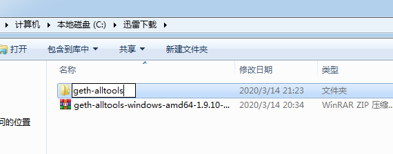

将geth-alltools拷贝到c盘根目录

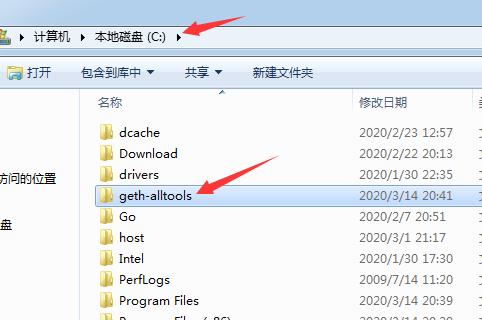


配置环境变量，操作如下：

对计算机点击右键，选属性

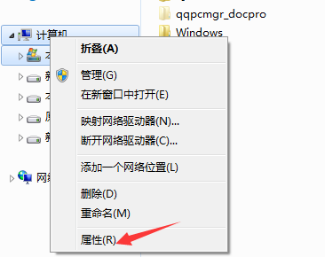


在属性内选高级系统设置

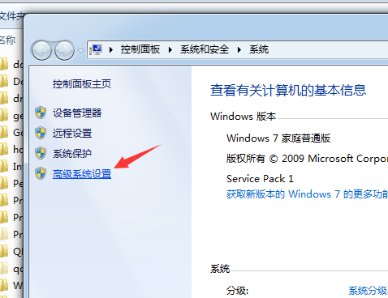


点击环境变量

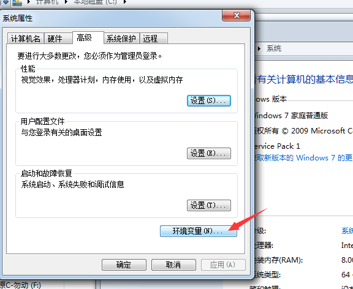

选择编辑Path环境变量

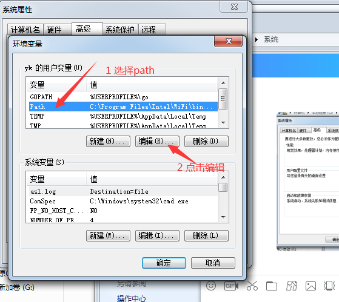

在Path变量值的最后增加;C:\geth-alltools，注意分号和冒号都用半角。

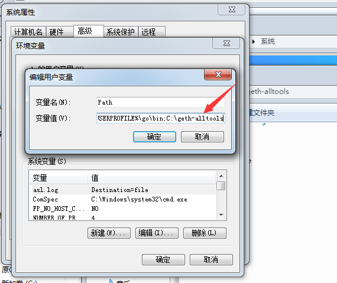


如果设置成功，在命令行窗口运行geth -h将会看到帮助信息，效果如下：

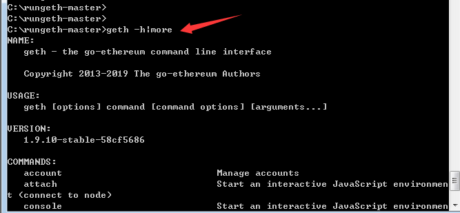

接下来，下载便于运行的工程 https://github.com/yekai1003/rungeth ，

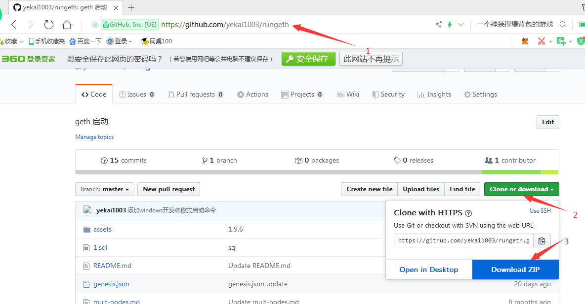

保存到c盘根目录

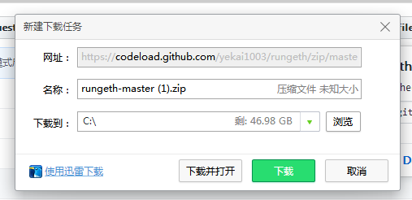

解压缩到当前路径下

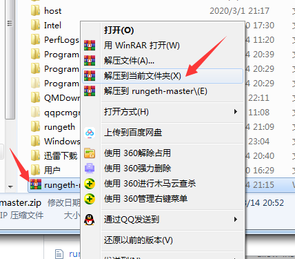


在rungeth-master路径下，【shift+右键】

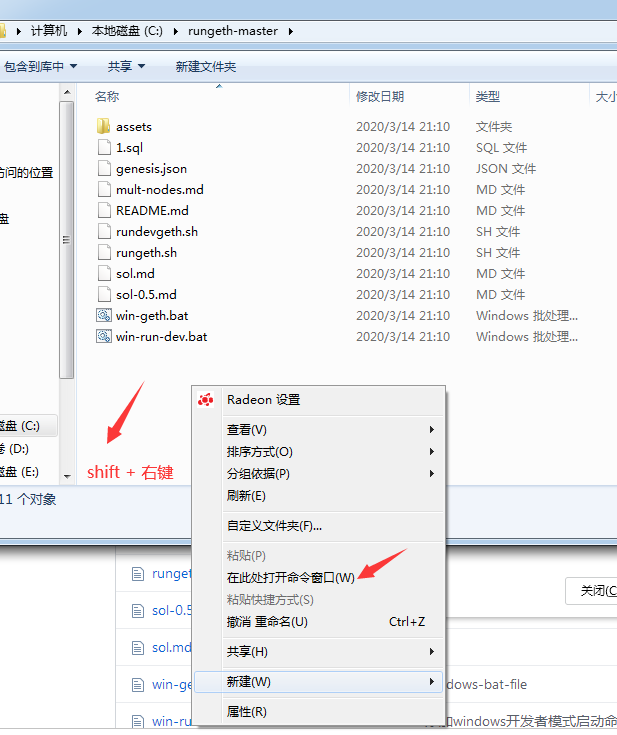

选择在此处打开命令窗口

运行geth初始化操作

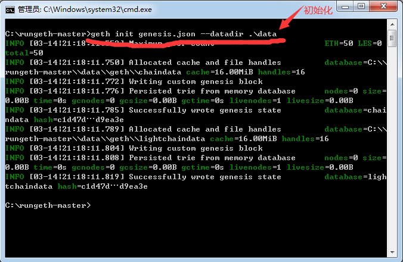

运行geth运行批处理脚本

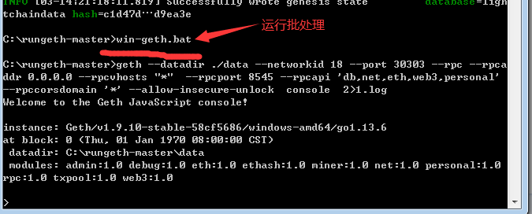


### 1.2 Linux系统安装

在类Unix系统都有两种选择，其一是命令行的方式，这种方式比较简单直接。在Linux系统下使用命令行的方式安装Geth，只需要执行下面四条指令就够了（以ubuntu系统为例）。

```sh
sudo apt-get install software-properties-common
sudo add-apt-repository -y ppa:ethereum/ethereum
sudo apt-get update
sudo apt-get install ethereum
```

第二种方式，自然也是下载可执行的二进制文件工具包。

步骤01：打开网站，选择对应版本


步骤02：右键，复制下载地址


步骤03：利用wget命令下载步骤02的地址

```sh
mkdir ~/install
cd ~/install
wget https://gethstore.blob.core.windows.net/builds/geth-alltools-linux-amd64-1.9.10-58cf5686.tar.gz
```

步骤04：解压缩下载的压缩包

```sh
tar zxvf geth-alltools-linux-amd64-1.9.10-58cf5686.tar.gz
```

步骤05：配置环境变量

```sh
mv geth-alltools-linux-amd64-1.9.10-58cf5686 ~/geth-home
export PATH=$HOME/geth-home:$PATH
echo `export PATH=$HOME/geth-home:$PATH` >> ~/.bashrc
```

步骤06：安装完成，检查安装效果

```sh
$ geth --help
NAME:
   geth - the go-ethereum command line interface

   Copyright 2013-2020 The go-ethereum Authors

USAGE:
   geth [options] command [command options] [arguments...]

VERSION:
   1.9.10-stable

COMMANDS:
   account                            Manage accounts
   attach                             Start an interactive JavaScript environment (connect to node)
   console                            Start an interactive JavaScript environment
   copydb                             Create a local chain from a target chaindata folder
   dump                               Dump a specific block from storage
   dumpconfig                         Show configuration values
   export                             Export blockchain into file
   export-preimages                   Export the preimage database into an RLP stream
   import                             Import a blockchain file
   import-preimages                   Import the preimage database from an RLP stream
   init                               Bootstrap and initialize a new genesis block
   inspect                            Inspect the storage size for each type of data in the database
   js                                 Execute the specified JavaScript files
   license                            Display license information
   makecache                          Generate ethash verification cache (for testing)
   makedag                            Generate ethash mining DAG (for testing)
   removedb                           Remove blockchain and state databases
   retesteth                          Launches geth in retesteth mode
   version                            Print version numbers
   wallet                             Manage Ethereum presale wallets
   help, h                            Shows a list of commands or help for one command


```

当看到比上面还要多的输出时，就代表我们Geth已经顺利安装完成了！


### 1.3 MacOS系统安装

在MacOS系统安装Geth，仍然可以选择命令行或下载压缩包的方式。我们还是先介绍命令行的安装方式，需要借助Brew工具。命令如下：

```sh
brew update
brew upgrade
brew tap ethereum/ethereum
brew install ethereum
```

下面我们来介绍里用安装包的方式安装。


得到下载地址后，后面的安装步骤与Linux基本相同，唯一需要注意的是，MacOS的环境变量配置文件在“~.bash_profile ”。全部安装步骤和命令如下($代表是命令行状态下)：

```sh
bogon:~ yk$mkdir ~/install
bogon:~ yk$cd ~/install
bogon:~ yk$wget https://gethstore.blob.core.windows.net/builds/geth-alltools-darwin-amd64-1.9.10-58cf5686.tar.gz
bogon:~ yk$tar zxvf geth-alltools-darwin-amd64-1.9.10-58cf5686.tar.gz
bogon:~ yk$mv geth-alltools-darwin-amd64-1.9.10-58cf5686 ~/geth-home
bogon:~ yk$export PATH=$HOME/geth-home:$PATH
bogon:~ yk$echo `export PATH=$HOME/geth-home:$PATH` >> ~/.bash_profile
```


## 2. Geth启动与操作说明

在安装好了Geth之后，我们需要知道如何启动它。不过在这之前，我们需要澄清几个概念：

- 主网  以太坊真实节点运行的网络，节点遍布全球，此网络中使用的“ether”是真实的虚拟数字货币，部署合约时需要消耗真金白银
- 测试网 测试网的节点没有主网节点那么多，主要是为了以太坊开发者提供一个测试的平台环境，此网络上的“ether”可以通过做任务或申请获得，没有实际价值
- 私网   私网是由开发者自行组建的网络，不与主网及测试网连通，独立存在，用于个人测试

需要明确的是，无论是主网、测试网还是私网，都可以使用Geth来启动。Geth直接运行，默认连接的就是以太坊主网，如果想要连接测试网可以连接Ropsten或rinkeby，指令参考如下：

```jsx
// Ropsten 测试网络
geth --testnet --fast --cache=512 console
// Rinkeby 测试网络
geth --rinkeby --fast --cache=512 console
```


### 2.1 创世块文件说明

将如下内容保存为genesis.json文件

```json
{
  "config": {
        "chainId": 18,
        "homesteadBlock": 0,
        "eip150Block": 0,
        "eip155Block": 0,
        "eip158Block": 0
    },
  "alloc"      : {},
  "coinbase"   : "0x0000000000000000000000000000000000000000",
  "difficulty" : "0x2",
  "extraData"  : "",
  "gasLimit"   : "0xffffffff",
  "nonce"      : "0x0000000000000042",
  "mixhash"    : "0x0000000000000000000000000000000000000000000000000000000000000000",
  "parentHash" : "0x0000000000000000000000000000000000000000000000000000000000000000",
  "timestamp"  : "0x00"
}
```

创世块文件的部分内容，我们可以简单了解一下：

- coinbase 挖矿后获得奖励的账户地址
- difficulty 挖矿难度
- gasLimit 一个区块所能容纳gas的上限
- nonce  随机值
- mixhash 一个256位的哈希证明，与nonce相结合，验证本块的有效性
- extraData 附加信息，随意填写
- parentHash 前一块的hash值，由于是创世块，所以为0

### 2.2 Geth搭建私网

步骤01：利用创世块文件初始化


```sh
geth init genesis.json --datadir ./data
```

在此步骤，主要是利用创世块进行文件初始化，指定一个数据目录，当看到类似下面的结果代表初始化成功。

```sh
INFO [02-14|16:42:36.647] Maximum peer count                       ETH=50 LES=0 total=50
INFO [02-14|16:42:36.796] Allocated cache and file handles         database=/Users/yk/ethdev/yekai1003/rungeth/data/geth/chaindata cache=16.00MiB handles=16
INFO [02-14|16:42:36.861] Writing custom genesis block 
INFO [02-14|16:42:36.862] Persisted trie from memory database      nodes=0 size=0.00B time=13.579µs gcnodes=0 gcsize=0.00B gctime=0s livenodes=1 livesize=0.00B
INFO [02-14|16:42:36.866] Successfully wrote genesis state         database=chaindata hash=c1d47d…d9ea3e
INFO [02-14|16:42:36.872] Allocated cache and file handles         database=/Users/yk/ethdev/yekai1003/rungeth/data/geth/lightchaindata cache=16.00MiB handles=16
INFO [02-14|16:42:36.899] Writing custom genesis block 
INFO [02-14|16:42:36.899] Persisted trie from memory database      nodes=0 size=0.00B time=5.75µs   gcnodes=0 gcsize=0.00B gctime=0s livenodes=1 livesize=0.00B
INFO [02-14|16:42:36.900] Successfully wrote genesis state         database=lightchaindata hash=c1d47d…d9ea3e
```

此时在data目录下，会有一些文件生成，通过tree命令可以查看。

```sh
root:rungeth yk$ tree data/
data/
├── geth
│   ├── chaindata
│   │   ├── 000001.log
│   │   ├── CURRENT
│   │   ├── LOCK
│   │   ├── LOG
│   │   └── MANIFEST-000000
│   └── lightchaindata
│       ├── 000001.log
│       ├── CURRENT
│       ├── LOCK
│       ├── LOG
│       └── MANIFEST-000000
└── keystore


```


步骤02：启动Geth节点

​	

```sh
geth --datadir ./data --networkid 18 --port 30303 --rpc  --rpcport 8545 --rpcapi 'db,net,eth,web3,personal' --rpccorsdomain "*" --gasprice 0 --allow-insecure-unlock  console 2> 1.log
```

这个命令的启动参数比较长，我们也需要针对参数进行介绍：

- datadir 指定之前初始化的数据目录文件
- networkid 配置成与配置文件config内的chainId相同值，代表加入哪个网络，私链就自己随意编号即可
- port 传说中的p2p端口，也就是节点之间互相通信的端口
- rpc 代表开启远程调用服务，这对我们很重要
- rpcport 远程服务的端口，默认是8545
- rpcapi 远程服务提供的远程调用函数集
- rpccorsdomain 指定可以接收请求来源的域名列表（浏览器访问，必须开启）
- gasprice gas的单价
- allow-insecure-unlock 新版本增加的选项，允许在Geth命令窗口解锁账户
- console 进入管理台
- 2> 1.log Unix系统下的重定向，将Geth产生的日志输出都重定向到1.log中，以免刷日志影响操作

启动后，将看到类似下面的结果：

```sh
Welcome to the Geth JavaScript console!

instance: Geth/v1.9.6-stable/darwin-amd64/go1.13.1
at block: 0 (Thu, 01 Jan 1970 08:00:00 CST)
 datadir: /Users/yk/ethdev/yekai1003/rungeth/data
 modules: admin:1.0 debug:1.0 eth:1.0 ethash:1.0 miner:1.0 net:1.0 personal:1.0 rpc:1.0 txpool:1.0 web3:1.0

> 
```

终于大功告成了！

### 2.3 开发者模式启动

```sh
geth --datadir ./devdata --networkid 18 --port 30303 --rpc --rpcaddr 0.0.0.0 --rpcvhosts "*"  --rpcport 8545 --rpcapi 'db,net,eth,web3,personal' --rpccorsdomain "*"  --dev --dev.period 1 console 2> 1.log
```

开发者的好处有几点：

- 自动挖矿
- 无需初始化
- 出块速度快
- 默认初始化了一个账户，金钱无限
- 默认账户无需解锁，也可以部署合约

### 2.4 利用github工程启动geth

由于前面的命令比较多，因此推荐使用现有的脚本完成。下载工程

```sh
git clone https://github.com/yekai1003/rungeth
cd rungeth
```

按照普通模式启动：

```sh
bogon:rungeth yk$ ./rungeth.sh 
Welcome to the Geth JavaScript console!

instance: Geth/v1.9.10-stable/darwin-amd64/go1.13.1
at block: 0 (Thu, 01 Jan 1970 08:00:00 CST)
 datadir: /Users/yk/ethdev/yekai1003/rungeth/data
 modules: admin:1.0 debug:1.0 eth:1.0 ethash:1.0 miner:1.0 net:1.0 personal:1.0 rpc:1.0 txpool:1.0 web3:1.0

> 

```

按照开发者模式启动

```sh
bogon:rungeth yk$ ./rundevgeth.sh 
Welcome to the Geth JavaScript console!

instance: Geth/v1.9.10-stable/darwin-amd64/go1.13.1
coinbase: 0x60b4af4456485a169c725efccd0e22efe019c7d1
at block: 1 (Tue, 18 Feb 2020 21:31:58 CST)
 datadir: /Users/yk/ethdev/yekai1003/rungeth/devdata
 modules: admin:1.0 clique:1.0 debug:1.0 eth:1.0 miner:1.0 net:1.0 personal:1.0 rpc:1.0 shh:1.0 txpool:1.0 web3:1.0

> 

```

### 2.5 Geth启动后操作说明

01：查看当前存在的账户

```sh
> eth.accounts
[]
```

默认不会有账户信息，需要创建后才能有

02：创建账户，注意传入的123是密码

```sh
> personal.newAccount("123")
"0x70aea0aea5bf9568a650598dfef44d6d3cca209a"
> eth.accounts
["0x70aea0aea5bf9568a650598dfef44d6d3cca209a"]
```

03：启动挖矿，start内的1是代表1个线程挖矿，null并非代表错误

```sh
> miner.start(1)
null
```


04：查看账户余额，都是挖矿所得

```sh
> eth.getBalance(eth.accounts[0])
95000000000000000000
```


05：再创建一个账户，密码456


```sh
> personal.newAccount("456")
"0xd56f07dc185c32f0367469b353c6cae711fa4a46"
```


06：给两个账户起别名acc0，acc1


```sh
> acc0=eth.accounts[0]
"0x70aea0aea5bf9568a650598dfef44d6d3cca209a"
> acc1=eth.accounts[1]
"0xd56f07dc185c32f0367469b353c6cae711fa4a46"
```

07：解锁账户1

```sh
> personal.unlockAccount(acc0)
Unlock account 0x70aea0aea5bf9568a650598dfef44d6d3cca209a
Password: 
true

```


08：转账给账户2，10个ether

```sh

> eth.sendTransaction({from:acc0,to:acc1,value:web3.toWei(10)})
"0x0ccfda6137ca5c9095f03498404223ae08910d811ab7b1a7497abe3834f9fae9"
```

09：查看账户2余额

```sh
> eth.getBalance(acc1)
10000000000000000000
```

10：退出geth

```sh
> exit
bogon:rungeth yk$ 
```


powershell

.\win-geth.bat

